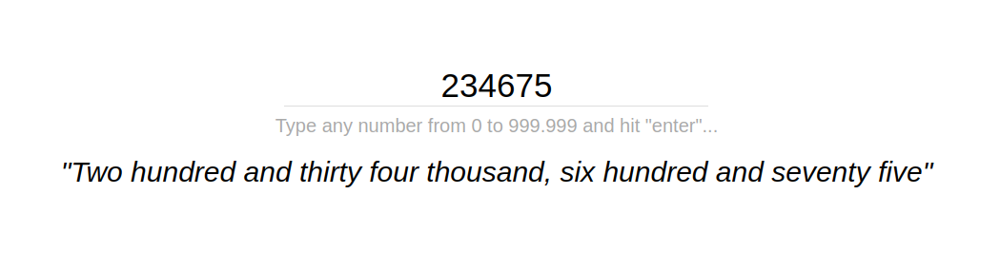

# Number2Words
See [Number2Words](https://mpicpus.github.io/number2words/) in action.
___
**Tech**: JS, HTML, CSS.

Will convert any number from 0 to 999,999 into its English word equivalent:

*(**Disclaimer**: no monkey pictures in this one whatsoever).*

Started as a way to introduce a young chap to the world of numbers and programming, yet it grew to its funky current state (along with the creator himself).

Plain and simple HTML static page, all magic occurrs inside `app.js` (as the sharpest of you might have guessed already...).
Any corrections/comments/suggestions are welcome.